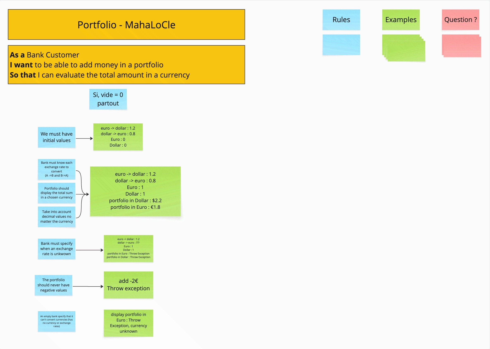

# Example Mapping

## Format de restitution
*(rappel, pour chaque US)*

```markdown
## Titre de l'US (post-it jaunes)

> Portfolio

### Règle Métier (post-it bleu)


- Bank must know each exchange rate to convert (A->B, B->A)
- Portfolio should display the total sum in a chosen currency 
- Take into account decimal values no matter the currencies

Example:
euro -> dollar : 1.2
dollar -> euro : 0.8
Euro : 1
Dollar : 1
portfolio in Dollar : $2.2
portfolio in Euro : €1.8

- Bank must specify when an exchange rate is unknown 

Example:
euro -> dollar : 1.2
dollar -> euro : ???
Euro : 1
Dollar : 1
portfolio in Euro : Throw Exception
portfolio in Dollar : Throw Exception

- The portfolio should never have negative values

Example: 
add -2€
Throw exception

- An empty bank specify that it can't convert currencies (has no currency or exchange rates)

Example: 
display portfolio in Euro : Throw Exception, currency unknown
```

Vous pouvez également joindre une photo du résultat obtenu en utilisant les post-its.

## Évaluation d'un portefeuille


