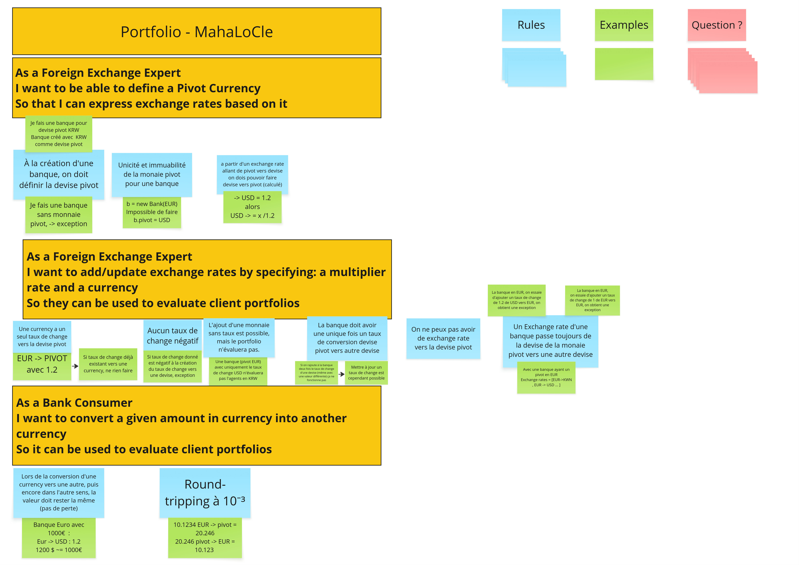

# Example Mapping

## Format de restitution
*(rappel, pour chaque US)*

```markdown
## Titre de l'US (post-it jaunes)

> Question (post-it rouge)

### Règle Métier (post-it bleu)

Exemple: (post-it vert)

- [ ] 5 USD + 10 EUR = 17 USD
```

Vous pouvez également joindre une photo du résultat obtenu en utilisant les post-its.

## Story 1: Define Pivot Currency

```gherkin
As a Foreign Exchange Expert
I want to be able to define a Pivot Currency
So that I can express exchange rates based on it
```
### Règle Métier 

>À la création d'une banque, on doit définir la devise pivot
1. Given a bank, When making a bank with KRW currency, bank is made KRW as the pivot currency
1. Je fais une banque sans monnaie pivot, -> exception

>. Unicité et immuabilité de la monaie pivot pour une banque
1. b = new Bank(EUR)
Impossible de faire b.pivot = USD
1. A partir d'un exchange rate allant de pivot vers devise on dois pouvoir faire devise vers pivot (calculé)
> -> USD = 1.2 alorsUSD -> = x /1.2

## Story 2: Add an exchange rate
```gherkin
As a Foreign Exchange Expert
I want to add/update exchange rates by specifying: a multiplier rate and a currency
So they can be used to evaluate client portfolios
```

>Une currency a un seul taux de change vers la devise pivot
1. EUR -> PIVOT avec 1.2

1. Si taux de change déjà existant vers une currency, ne rien faire

> Aucun taux de change négatif
1.Si taux de change donné est négatif à la création du taux de change vers une devise, exception

>L'ajout d'une monnaie  sans taux est possible, mais le portfolio n'évaluera pas.

1.Une banque (pivot EUR) avec uniquement le taux de change USD n'évaluera pas l'agents en KRW

>La banque doit avoir une unique fois un taux de conversion devise pivot vers autre devise

1. Si on rajoute à la banque deux fois le taux de change d'une devise (même avec une valeur différente) ça ne fonctionne pas

1. Mettre à jour un taux de change est cependant possible

> On ne peux pas avoir de exchange rate vers la devise pivot

> Un Exchange rate d'une banque passe toujours de la devise de la monaie pivot vers une autre devise

1. La banque en EUR, on essaie d'ajouter un taux de change de 1.2 de USD vers EUR, on obtient une exception

1. La banque en EUR,
on essaie d'ajouter un taux de change de 1 de EUR vers EUR, on obtient une exception

1. Avec une banque ayant un pivot en EUR
Exchange rates = [EUR->KWN , EUR -> USD ... ]

## Story 3: Convert a Money

```gherkin
As a Bank Consumer
I want to convert a given amount in currency into another currency
So it can be used to evaluate client portfolios
```

> Lors de la conversion d'une currency vers une autre, puis encore dans l'autre sens, la valeur doit rester la même (pas de perte)

1. Banque Euro avec
1000€  :
Eur -> USD : 1.2
1200 $ ~= 1000€

> Round-tripping à 10⁻³

1. 10.1234 EUR -> pivot = 20.246
20.246 pivot -> EUR = 10.123 

